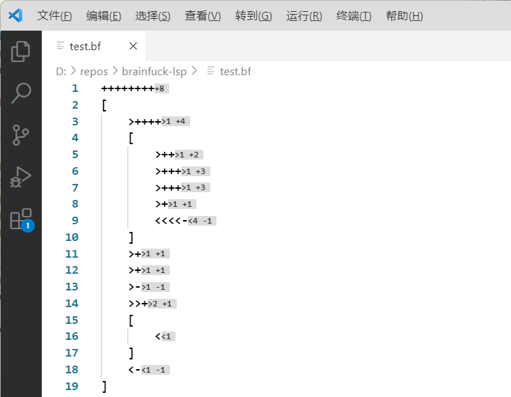

# Brainfuck All In One
[Brainfuck All In One](https://marketplace.visualstudio.com/items?itemName=BabyPenguin.vscode-brainfuck) provides full support for brainfuck developing.

**For this extension to work, your brainfuck file should have '.bf' file extension.**

## Features
* Formatting
* Inlay Hints
* Linting
* Running brainfuck program with/without JIT
* Debugging 



### Supported Platforms:
* Windows x86_64
* Linux x86_64

### Formatting
Use 'Format Document' command to format current .bf file.

The formatter will try to format in following rule:
1. '\[' & '\]' will occupy a single line and indent internal symbols.
2. zero or more movements(<>), one or more calculations(+-), and zero or more IO(.,) will compose a line.

### Inlay Hints
Could be configured via "vscodeBrainfuck.enableInlayHints", default value is true.

### Linting
The linting tool will work automatically for .bf files.

Linting rules:
1. only '[]+-<>,.' are valid brainfuck symbols
2. support '//' & '/* */' style comment

### Running brainfuck
The extension provides three commands:
* 'Brainfuck: Run current file with JIT enabled': This command will precompile the whole program into x86_64 assembly code and then start executing. This mode is suitable for compute-intensive programs.
* 'Brainfuck: Run current file without JIT": This command will interpret brainfuck program one token after another. This mode is suitable for small programs.
* 'Brainfuck: Run current file with automatic JIT': This command will first launch the program without JIT, and when it detects a loop is executed for 3 times, it will trigger JIT to begin compiling this loop in background and switch to compiled code when ready. This mode is balanced.

### Debugging
The extension provides a DAP to run and debug .bf file, and supports following features:
1. breakpoint
2. stepping
3. view current pointer and memory

To debug a .bf file, use following config in .vscode/launch.json:
```
  {
      "name": "debug",
      "type": "brainfuck",
      "request": "launch",
      "program": "${workspaceFolder}/test.bf"
  }
```

### Update Log
* 0.1.0: Initial release.
* 0.1.1: Fix jit bug.
* 0.1.2: Support inlay hints configuration.

## More Infomation
* [Marketplace link](https://marketplace.visualstudio.com/items?itemName=BabyPenguin.vscode-brainfuck&ssr=false#overview)
* [Github homepage](https://github.com/GeniusPenguin9/Brainfuck_All_In_One)
* [Submit an issue](https://github.com/GeniusPenguin9/Brainfuck_All_In_One/issues/new)
* [History versions](https://marketplace.visualstudio.com/items?itemName=BabyPenguin.vscode-brainfuck&ssr=false#version-history)